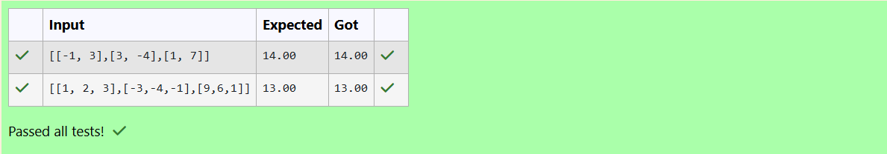
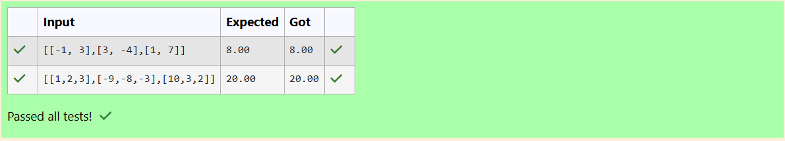

# Norm of a matrix
## Aim
To write a program to find the 1-norm, 2-norm and infinity norm of the matrix and display the result in two decimal places.
## Equipment’s required:
1.	Hardware – PCs
2.	Anaconda – Python 3.7 Installation / Moodle-Code Runner
## Algorithm:
	1. Import the NumPy as np.
	2. Store the user input using np.array() and store it in a variable named mat. 
    3. Find the 1-Norm of the matrix using np.linalg.norm(mat, 1) and also the 2-Norm of the matrix using np.linalg.norm(mat, 2).
	4. Find the Infinity Norm of the matrix using np.linalg.norm(mat, np.inf).
	5. Print the 1-Norm, 2-Norm, and Infinity Norm values of the matrix as the final output.
## Program:
```Python
# Register No: 212224220027
# Developed By: ENBANATHAN V
# 1-Norm of a Matrix
import numpy as np
mat = np.array(eval(input()))
ans=np.linalg.norm(mat,1)
noem_of_matrix="{:.2f}".format(ans)
print(noem_of_matrix)

# 2-Norm of a Matrix
import numpy as np
mat = np.array(eval(input()))
ans=np.linalg.norm(mat,2)
noem_of_matrix="{:.2f}".format(ans)
print(noem_of_matrix)

# Infinity Norm of a Matrix
import numpy as np
mat = np.array(eval(input()))
ans=np.linalg.norm(mat,np.inf)
noem_of_matrix="{:.2f}".format(ans)
print(noem_of_matrix)

```
## Output:
### 1-Norm of a Matrix


### 2-Norm of a Matrix


### Infinity Norm of a Matrix


## Result
Thus the program for 1-norm, 2-norm and Infinity norm of a matrix are written and verified.
